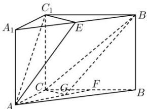

<!-- question-source:start -->
【61】（2023·全国高三专题练习）如图，在直棱柱 $ABC-A_{1}B_{1}C_{1}$ 中，点E,F分别为 $A_{1}B_{1}$ ,BC的中点，点G是线段AF上的动点.确定点G的位置，使得平面 $AC_{1}E//$ 平面 $B_{1}CG$ ，并给予证明.

<!-- question-source:end -->

![[Q00005963A1]]
