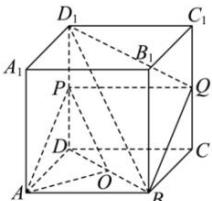

> [!faq]- 全练一本通解析
> **【答案】** 证明见解析
>
> **【解析】**
> 当 Q 为 $CC_{1}$ 的中点时, 平面 $D_{1}BQ //$ 平面 PAO, 理由如下: 连接 PQ,
> 
> 因为 $Q$ 为 $CC_{1}$ 的中点， $P$ 为 $DD_{1}$ 的中点，所以 $PQ // DC, PQ = DC$ 又正方体 $ABCD - A_{1}B_{1}C_{1}D_{1}$ 中， $AB // DC, AB = DC$ ，所以 $PQ // AB, PQ = AB$ 则四边形 $PQBA$ 为平行四边形，所以 $AP // BQ$ 因为 $QB \subsetneq$ 平面 $PAO, PA \subsetneq$ 平面 $PAO$ ，所以 $QB //$ 平面 $PAO$ 。因为 $P, O$ 分别为 $DD_{1}, DB$ 的中点，所以 $PO$ 为 $\triangle DBD_{1}$ 的中位线。所以 $D_{1}B // PO$ 。因为 $D_{1}B \subsetneq$ 平面 $PAO, PO \subsetneq$ 平面 $PAO$ ，所以 $D_{1}B //$ 平面 $PAO$ 。又 $D_{1}B \cap QB = B, D_{1}B, QB \subsetneq$ 平面 $D_{1}BQ$ ，所以平面 $D_{1}BQ //$ 平面 $PAO$ 。
