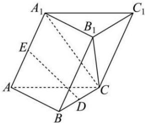

## 题型 6: 确定面面平行的点的位置

![[高中/课堂同步/题库/高中数学全练一本通/立体几何初步/第五节 空间直线、平面的平行/重点题型专练/题型 6_ 确定面面平行的点的位置/questions/Q00005960.md]]
![[高中/课堂同步/题库/高中数学全练一本通/立体几何初步/第五节 空间直线、平面的平行/重点题型专练/题型 6_ 确定面面平行的点的位置/questions/Q00005961.md]]
![[高中/课堂同步/题库/高中数学全练一本通/立体几何初步/第五节 空间直线、平面的平行/重点题型专练/题型 6_ 确定面面平行的点的位置/questions/Q00005962.md]]
![[高中/课堂同步/题库/高中数学全练一本通/立体几何初步/第五节 空间直线、平面的平行/重点题型专练/题型 6_ 确定面面平行的点的位置/questions/Q00005963.md]]
