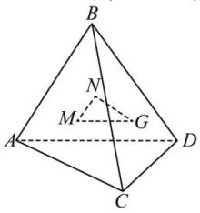

<!-- question-source:start -->
【44】(2023·全国高三专题)如图所示, $B$ 为 $\triangle ACD$ 所在平面外一点, $M$ 、 $N$ 、 $G$ 分别为 $\triangle ABC$ 、 $\triangle ABD$ 、 $\triangle BCD$ 的重心. 求证: 平面 $MNG//$ 平面 $ACD$ .
<!-- question-source:end -->

![[Q00008905A1]]
