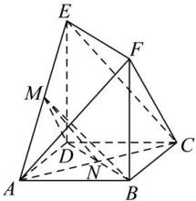

> [!faq]- 全练一本通解析
> **【答案】** 证明见解析
>
> **【解析】**
> 因为 $\left|BF\right|=\left|DE\right|$ , BF // DE, 所以四边形 BDEF 为平行四边形, 故 BD // EF,
> 又 BD ≠ 平面 CEF, EF ⊂ 平面 CEF, 所以 BD // 平面 CEF;
> 连接 AC 交 BD 于 N, 连接 MN, 因为四边形 ABCD 是正方形, 故 N 为 AC 中点,
> $M$ 是 $AE$ 的中点, 在 $\triangle ACE$ 中, 有 $MN // EC$ , $MN \not\subset$ 平面 $CEF$ , $EC \subset$ 平面 $CEF$ ,
> 所以 $MN //$ 平面 $CEF$ , 且 $BD \subset$ 平面 $BDM$ , $MN \subset$ 平面 $BDM$ , $BD \cap MN = N$ ,
> 所以平面 $BDM //$ 平面 $CEF$ .
> 
