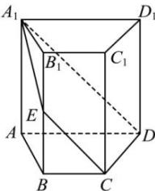

<!-- question-source:start -->
【52】（2022·全国高一课后作业）如图，在四棱柱 $ABCD - A_{1}B_{1}C_{1}D_{1}$ 中，底面ABCD为梯形， $AD / / BC$ 平面 $A_{1}DCE$ 与 $BB_{1}$ 交于点 $E$ ，求证： $EC / / A_{1}D$ ：

<!-- question-source:end -->

![[Q00005954A1]]
