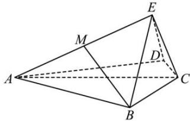

<!-- question-source:start -->
【55】（2023·河北模拟）如图，四棱锥 E-ABCD， $AB=AD=\sqrt{3}$ ，CD=CB=1，AC=2，平面 $EAC \perp$ 平面 ABCD，平面 $ABE \cap$ 平面 CDE=l，点 M 为线段 AE 中点，求证：BM//l。

<!-- question-source:end -->

![[Q00005957A1]]
