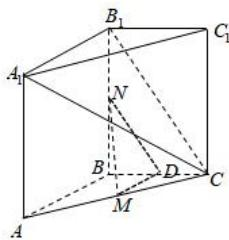

> [!faq]- 全练一本通解析
> **【答案】** 证明见解析
>
> **【解析】**
> 取 BC 中点 D, 连接 ND、MD,
> 则有 $ND//B_{1}C$ , $MD//AB$ , 又 $ND \not\subset$ 平面 $A_{1}B_{1}C$ , $B_{1}C \subset$ 平面 $A_{1}B_{1}C$ , 所以 ND// 平面 $A_{1}B_{1}C$ ;
> 因为 $A_{1}B_{1} // AB$ , 所以有 $MD // A_{1}B_{1}$ , 又 $MD \not\subset$ 平面 $A_{1}B_{1}C$ , $A_{1}B_{1} \subset$ 平面 $A_{1}B_{1}C$ , 所以有 $MD //$ 平面 $A_{1}B_{1}C$ , 又 $ND \cap MD = D$ , 所以平面 $MND //$ 平面 $A_{1}B_{1}C$ ; $MN \subset$ 平面 MND, 所以 $MN //$ 平面 $A_{1}B_{1}C$ .
> 
