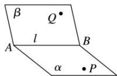
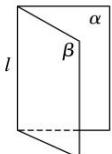
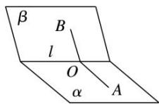

## 1. 二面角

（1）定义:从一条直线出发的两个半平面所组成的图形叫做二面角,这条直线叫二面角的棱,这两个半平面叫二面角的面.图中的二面角可记作:二面角 $\alpha - AB - \beta$ 或 $\alpha - l - \beta$ 或 P - AB - Q.

平卧式

直立式

（2）二面角的平面角:如图,在二面角 $\alpha-l-\beta$ 的棱 l 上任取一点 O,以点 O 为垂足,在半平面 $\alpha$ 和 $\beta$ 内分别作垂直与直线 l 的射线 OA, OB, 则射线 OA 和 OB 构成的 $\angle AOB$ 叫做二面角的平面角.平面角是直角的二面角叫做直二面角.

