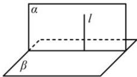
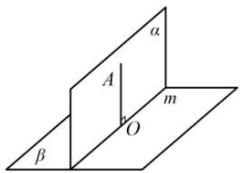

## 2. 平面与平面垂直的判定定理与性质定理

<table><tr><td rowspan="2">判定定理</td><td>自然语言</td><td>图形语言</td><td>符号语言</td></tr><tr><td>一个平面过另一个平面的垂线,则这两个平面垂直.</td><td></td><td> $\left.\begin{matrix}l\subset\alpha \\l\perp\beta\end{matrix}\right\}\Rightarrow\alpha\perp\beta$ </td></tr><tr><td>性质定理</td><td>两个平面垂直,则一个平面内垂直于交线的直线与另一个平面垂直.</td><td></td><td> $\left.\begin{matrix}\alpha\perp\beta \\ \alpha\cap\beta=m \\ AO\subset\alpha \\ AO\perp m\end{matrix}\right\}\Rightarrow AO\perp\beta$ </td></tr></table>
