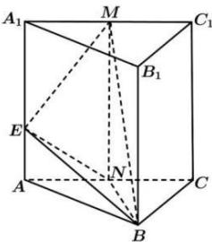

<!-- question-source:start -->
【11】如图, 在正三棱柱 $ABC-A_{1}B_{1}C_{1}$ 中, AB=4, $AA_{1}=3\sqrt{2}$ , M, N 分别是 $A_{1}C_{1}$ , AC 的中点, E 在 $AA_{1}$ 上, $A_{1}E=2EA$ , 求证: 平面 $MEB \perp$ 平面 BEN;

<!-- question-source:end -->

![[Q00006077A1]]
