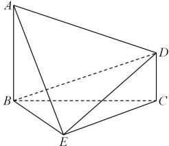

<!-- question-source:start -->
【13】（2023·全国高一专题）已知 $AB \perp$ 平面 BCE， $CD \parallel AB$ ， $\triangle BCE$ 是正三角形，AB = BC = 2CD。求证：平面 $ADE \perp$ 平面 ABE；

<!-- question-source:end -->

![[Q00006079A1]]
