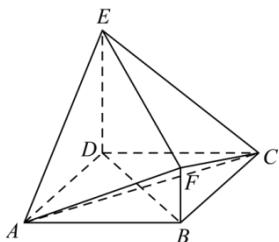

<!-- question-source:start -->
【14】(2023·河南高三模拟)如图,四边形ABCD为菱形, $ED\perp$ 平面ABCD, $BD=\sqrt{2}ED=2\sqrt{2}FB$ , $FB\parallel ED$ ,证明:平面 $EAC\perp$ 平面FAC.

<!-- question-source:end -->

![[Q00006080A1]]
