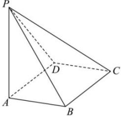

<!-- question-source:start -->
【16】如图,四棱锥P-ABCD的底面ABCD是边长为1的菱形, $\angle BCD=60^{\circ}$ ,PA⊥底面ABCD,PA= $\sqrt{3}$ ,在CD上确定一点E,使平面PBE⊥平面PAB.</td><td>利用面面垂直的性质定理,证明线面垂直的问题时,要注意以下三点:(1)两个平面垂直;(2)直线必须在其中一个平面内;(3)直线必须垂直于它们的交线.</td></tr><tr><td></td><td>
<!-- question-source:end -->

![[Q00006082A1]]
