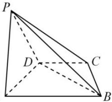
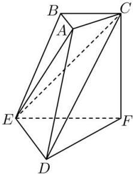

<!-- question-source:start -->
【18】(2023·全国高三专题练习)如图,在三棱台ABC-DEF中,CF⊥平面DEF,AB⊥BC,EF=CF=2BC,试问在线段BE上是否存在点G,使得平面DFG⊥平面CDE?若存在,请确定G点的位置.</td><td>A</td></tr><tr><td></td><td>
<!-- question-source:end -->

![[Q00006086A1]]
