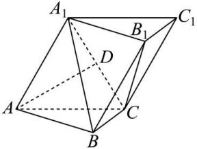

<!-- question-source:start -->
【21】(2023·全国高三专题练习)如图,在三棱柱 $ABC-A_{1}B_{1}C_{1}$ 中,侧面 $AA_{1}C_{1}C$ ⊥底面ABC,侧面 $AA_{1}C_{1}C$ 是菱形, $AC=BC=2$ , $\angle A_{1}AC=60^{\circ}$ , $\angle ACB=90^{\circ}$ .若D为 $A_{1}C$ 的中点,求证: $AD\perp A_{1}B$ .</td></tr><tr><td></td><td></td></tr></table>
<!-- question-source:end -->

![[Q00006087A1]]
