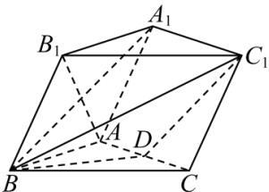

<!-- question-source:start -->
【22】(2024·全国高三专题)三棱柱 $ABC-A_{1}B_{1}C_{1}$ 中，平面 $A_{1}B_{1}BA \perp$ 平面 ABC, AB = AC = $AB_{1} = AA_{1} = 2$ , $AC \perp AB_{1}$ , D 为 AC 的中点. 求证: 平面 $ACC_{1}A_{1} \perp$ 平面 $A_{1}B_{1}BA$ .

<!-- question-source:end -->

![[Q00006088A1]]
