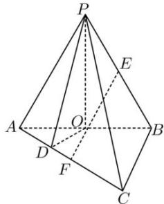

<!-- question-source:start -->
【23】（2023·全国高三专题）如图, 三棱锥 P-ABC 中, $\triangle PAB$ , $\triangle ABC$ 为等边三角形, PA=4, O 为 AB 中点, 点 D 在 AC 上, 满足 AD=1, 且面 $PAB \perp$ 面 ABC. 证明: $DC \perp$ 面 POD.

<!-- question-source:end -->

![[Q00006089A1]]
