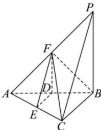

<!-- question-source:start -->
【26】（2022·江苏南通高三上期中）如图，在四棱锥P-ABC中，已知底面ABC是直角三角形，其中 $\angle ABC=90^{\circ}$ ，AB=BP，平面 $PAB\perp$ 平面ABC，点D,E,F分别是AB，AC，AP的中点.求证：
（1）平面 DEF// 平面 PBC；
（2）平面 PAC⊥平面 BCF.

<!-- question-source:end -->

![[Q00006092A1]]
