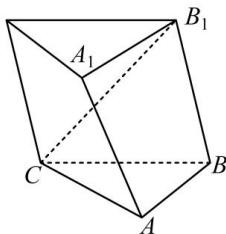

<!-- question-source:start -->
【15】如图, 三棱柱 $ABC - A_{1}B_{1}C_{1}$ 的所有棱长都为 2, $B_{1}C = \sqrt{6}$ , $AB \perp B_{1}C$ , 求证: 平面 $ABB_{1}A_{1} \perp$ 平面 $ABC$ .

<!-- question-source:end -->

![[Q00008927A1]]
