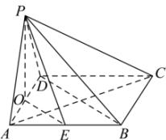

> [!faq]- 全练一本通解析
> **【答案】** 证明见解析
>
> **【解析】**
> 
> 如图, 连接 BD, 取 AD 中点 O, 连接 PO, OE, 因底面 ABCD 为菱形, 故 $AC \perp BD$ , 又 E 为棱 AB 的中点, 故 $OE \parallel BD$ , 则 $AC \perp OE$ , 已知 $AC \perp PE, OE, PE \subset$ 平面 POE, $OE \cap PE = E$ , 故 $AC \perp$ 平面 POE, 因 $PO \subset$ 平面 POE, 则 $AC \perp PO$ , 因 PA = PD, 则 $PO \perp AD$ , 又 $AD, AC \subset$ 平面 ABCD, $AD \cap AC = A$ , 则 $PO \perp$ 平面 ABCD, 又 $PO \subset$ 平面 PAD, 故平面 PAD ⊥ 平面 ABCD.
