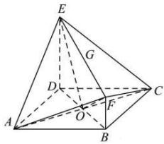

> [!faq]- 全练一本通解析
> **【答案】** 证明见解析
>
> **【解析】**
> 设 $BD$ 交 $AC$ 于点 $O$ , 连接 $EO, FO$ , 因为四边形 $ABCD$ 为菱形, 所以 $AC \perp BD$ . 因为 $ED \perp$ 平面 $ABCD, AC \subset$ 平面 $ABCD$ , 所以 $AC \perp ED$ . 又 $ED \cap BD = D, ED, BD \subset$ 平面 $BDEF$ , 所以 $AC \perp$ 平面 $BDEF$ ; 又 $EO \subset$ 平面 $BDEF$ , 所以 $AC \perp EO$ . 设 $FB = 1$ , 由题意得 $ED = 2, BD = 2\sqrt{2}, DO = BO = \sqrt{2}$ . 因为 $FB // ED$ , 且 $ED \perp$ 面 $ABCD$ , 则 $FB \perp$ 平面 $ABCD$ , 而 $OB, OD \subset$ 平面 $ABCD$ , 故 $OB \perp FB, OD \perp ED$ ,
> 所以 $OF=\sqrt{OB^{2}+BF^{2}}=\sqrt{3}$ ， $EO=\sqrt{ED^{2}+DO^{2}}=\sqrt{6}$ $EF=\sqrt{BD^{2}+\left(ED-BF\right)^{2}}=\sqrt{8+1}=3.$ 因为 $EF^{2}=OE^{2}+OF^{2}$ ，所以 $EO \perp FO$ .
> 因为 $OF \cap AC = O$ , $OF, AC \subset$ 平面 ACF, 所以 $EO \perp$ 平面 ACF.
> 又 $EO \subset$ 平面 FAC. 所以平面 $FAC \perp$ 平面 FAC.
> $$
> F A C.
> $$
> 
