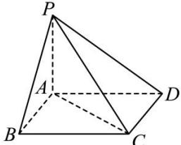

<!-- question-source:start -->
【28】（2024·全国高一课时练习）四边形 ABCD 是正方形, PA⊥平面 ABCD, 且 PA=AB. 求：

（1）二面角 A-PD-C 的平面角的度数；
（2）二面角 B-PA-D 的平面角的度数；
（3）二面角 B-PA-C 的平面角的度数；
（4）二面角 B-PC-D 的平面角的度数.
<!-- question-source:end -->

![[Q00006094A1]]
