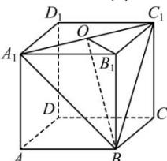

> [!faq]- 全练一本通解析
> **【答案】** $\sqrt{2}$
>
> **【解析】**
> 如图,取 $A_{1}C_{1}$ 的中点 O, 连接 $B_{1}O$ , BO, 则 $B_{1}O \perp A_{1}C_{1}$ ,
> 
> 又 $BA_{1} = BC_{1}$ ， $O$ 为 $A_{1}C_{1}$ 的中点，故 $BO\bot A_{1}C_{1}$ 故 $\angle BOB_{1}$ 是二面角 $B - A_{1}C_{1} - B_{1}$ 的平面角.因为 $BB_{1}\bot$ 平面 $A_{1}B_{1}C_{1}D_{1}$ ， $OB_{1}\subset$ 平面 $A_{1}B_{1}C_{1}D_{1}$ ，所以 $BB_{1}\bot OB_{1}$ 设正方体的棱长为 $a$ ，则 $OB_{1} = \frac{\sqrt{2}}{2} a$ ，在Rt△BB₁O中， $\tan \angle BOB_1 = \frac{BB_1}{OB_1} = \frac{a}{\frac{\sqrt{2}a}{2}} = \sqrt{2}$ 所以二面角 $B - A_{1}C_{1} - B_{1}$ 的正切值为 $\sqrt{2}$
