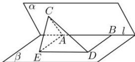

> [!faq]- 全练一本通解析
> **【答案】** $\frac{\pi}{3}$
>
> **【解析】**
> 如图所示，在平面 $\beta$ 内过 $A$ 作 $BD$ 的平行线 $AE$ ，且使得 $AE = BD$ 连接CE,ED，因为 $BD\bot l$ ，可得 $AE\bot l$ ，所以四边形AEDB是一个矩形，且∠CAE是二面角 $\alpha -l - \beta$ 的一个平面角，因为 $AB\bot AC,AB\bot AE$ ，且 $AC\cap AE = A$ ， $AC,AE\subset$ 平面ACE，所以 $AB\bot$ 面ACE，又因为 $AB / / DE$ ，所以 $DE\bot$ 平面ACE，因为 $CE\subset$ 平面ACE，可得 $DE\bot CE$ 在直角△CDE中，可得 $CE = \sqrt{CD^2 - ED^2} = \sqrt{CD^2 - AB^2} = \sqrt{7^2 - 6^2} = \sqrt{13}$ 在 $\triangle AEC$ 中，由余弦定理可知 $\cos \angle CAE = \frac{AC^2 + AE^2 - CE^2}{2AC\times AE} = \frac{3^2 + 4^2 - 13}{2\times 3\times 4} = \frac{1}{2},$ 因为 $\angle CAE\in [0,\pi ]$ ，可得 $\angle CAE = \frac{\pi}{3}$ ，即二面角 $\alpha -l - \beta$ 的大小为 $\frac{\pi}{3}$
> 
