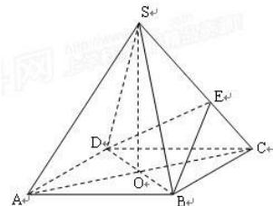

<!-- question-source:start -->
【33】（2018·北京朝阳二模）如图所示，在四棱锥 $S - ABCD$ 中，底面 $ABCD$ 是正方形，其他四个侧面都是等边三角形， $AC$ 与 $BD$ 的交点为 $O$ . （1）求证： $SO \perp$ 平面 $ABCD$ ；（2）已知 $E$ 为侧棱 $SC$ 上一个动点．试问对于 $SC$ 上任意一点 $E$ ，平面 $BDE$ 与平面 $SAC$ 是否垂直？若垂直，请加以证明；若不垂直，请说明理由.

<!-- question-source:end -->

![[Q00006099A1]]
