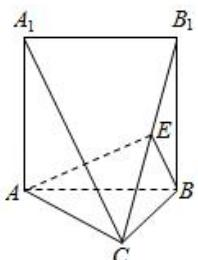

<!-- question-source:start -->
【35】(2023·全国高一专题)三棱柱 $ABC-A_{1}B_{1}C_{1}$ 被平面 $A_{1}B_{1}C$ 截去一部分得到如图的几何体， $BB_{1}\perp$ 平面 ABC， $\angle ABC=90^{\circ}$ ， $BC=BB_{1}$ ，E 为棱 $B_{1}C$ 上的动点（不包含端点），面 ABE 交 $A_{1}C$ 于点 F.

（1）求证： $AB\perp$ 平面 $B_{1}BC$ ;

（2）求证：EF//AB；

（3）试问是否存在点 E，使得平面 $ABE\perp$ 平面 $A_{1}B_{1}C$ ？并说明理由.

<!-- question-source:end -->

![[Q00006101A1]]
