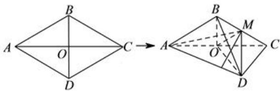

<!-- question-source:start -->
【36】（2011·北京西城二模）如图,菱形ABCD的边长为6, $\angle BAD=60^{\circ}$ , $AC\cap BD=O$ ,将菱形ABCD沿对角线AC折起,得到三棱锥B-ACD,点M是棱BC的中点, $DM=3\sqrt{2}$ .

（1）求证:OM∥平面ABD.

（2）求证:平面ABC⊥平面MDO.

（3）求三棱锥M-ABD的体积.

<!-- question-source:end -->

![[Q00006102A1]]
