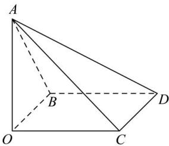

<!-- question-source:start -->
【37】（2024·上海高二期末）如图, 已知正方形 OBDC 的边长为 1, AO ⊥ 平面 OBDC, 三角形 ABC 是等边三角形.
（1）求异面直线 AC 与 BD 所成的角的大小；
（2）在线段 AC 上是否存在一点 E，使得 ED 与平面 BCD 所成的角大小为 $30^{\circ}$ ？若存在，求出 CE 的长度，若不存在，说明理由.

<!-- question-source:end -->

![[Q00006103A1]]
