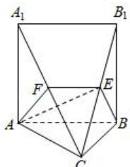

> [!faq]- 全练一本通解析
> **【答案】** （1）证明见解析；（2）证明见解析；（3）存在点 E，当点 E 为 $B_{1}C$ 中点时，理由见解析.
>
> **【解析】**
> （1）证明：
> 由三棱柱的几何特征，
> ∵ $BB_{1} \perp$ 平面 ABC, $AB \subset$ 平面 ABC, ∴ $BB_{1} \perp AB$ .
> ∵ $\angle ABC = 90^{\circ}$ , ∴ $BC \perp AB$ .
> 又∵ $BB_{1} \cap BC = B$ , $BB_{1} \subset$ 平面 $B_{1}BC$ , $BC \subset$ 平面 $B_{1}BC$ ,
> ∴ $AB \perp$ 平面 $B_{1}BC$ .
> （2）证明：如图，
> 
> 在三棱柱 $ABC - A_{1}B_{1}C_{1}$ 中， $AB // A_{1}B_{1}$ ， $\because AB \notin$ 平面 $A_{1}B_{1}C$ ， $A_{1}B_{1} \subset$ 平面 $A_{1}B_{1}C$ ， $\therefore AB //$ 平面 $A_{1}B_{1}C$ 。
> $$
> A B \subset
> $$
> $$
> A B E F
> $$
> $$
> \therefore E F \parallel A B
> $$
> $$
> A B E F \cap
> $$
> $$
> A _ {1} B _ {1} C = E F
> $$
> （3）存在点 E，当点 E 为 $B_{1}C$ 中点时，平面 $ABE \perp$ 平面 $A_{1}B_{1}C$ .
> 证明：∵ $BC = BB_{1}$ ，点 E 为 $B_{1}C$ 中点
> ∴ $BE \perp B_{1}C$ .
> ∵ AB⊥平面 $B_{1}BC$ ，BE⊂平面 $B_{1}BC$ ∴ AB⊥BE.
> ∵ $AB//A_{1}B_{1}$ ，∴ $BE \perp A_{1}B_{1}$ .
> 又∵ $A_{1}B_{1} \cap B_{1}C = B_{1}$ ， $A_{1}B_{1} \subset$ 面 $A_{1}B_{1}C$ ， $B_{1}C \subset$ 面 $A_{1}B_{1}C$ ∴ BE⊥平面 $A_{1}B_{1}C$ . BE⊂平面 ABE
> ∴ 平面 ABE⊥平面 $A_{1}B_{1}C$ .
