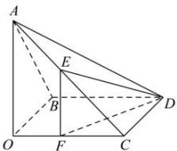

> [!faq]- 全练一本通解析
> **【答案】** （1） $45^{\circ}$ ；（2）存在，1 $$ B D / / O C $$
>
> **【解析】**
> （1）因为 OBDC 为止方形，则 BD // OC，
> 则异面直线 AC 与 BD 所成的角为 AC 与 OC 所成的角，即 $\angle ACO$ 或其补角，
> 因为三角形 ABC 是等边三角形，则 $BC = AB = AC = \sqrt{2}$ ,
> ∵ AO ⊥ 平面 OBDC, OC ⊂ 平面
> OBDC, ∴ AO ⊥ OC, ∴ AO = 1, ∴ $\tan\angle ACO=\frac{AO}{OC}=1,\therefore\angle ACO=45^{\circ}$ .
> 所以异面直线 AC 与 BD 所成的角为 $45^{\circ}$ .
> (2)
> 作 EF // AO 交 OC 于点 F，连接 DE, DF，
> ∵ AO ⊥ 平面 OBDC, ∴ EF ⊥ 平面 OBDC,
> 则 ED 与平面 BCD 所成的角为 $\angle EDF$ 设 CF = x,
> 则 $EF = x, DF = \sqrt{1 + x^{2}}, \therefore \tan 30^{\circ} = \frac{\sqrt{3}}{3} = \frac{EF}{DF} = \frac{x}{\sqrt{1 + x^{2}}} \Rightarrow x = \frac{\sqrt{2}}{2}$ ,
> 则 $CE = \sqrt{EF^{2} + CF^{2}} = \sqrt{2}x = 1$ .
> 
