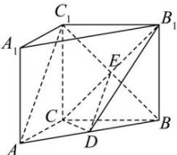
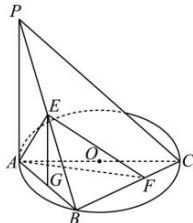

> [!faq]- 全练一本通解析
> **【答案】** （1）证明见解析（2） $\frac{4\sqrt{19}}{19}$
>
> **【解析】**
> 
> （1）证明：因为 PA 垂直于 $\odot O$ 所在的平面，即 $PA \perp$ 平面 ABC, BC ⊆ 平面 ABC，
> 所以 $PA \perp BC$ 又 AC 为 $\odot O$ 的直径，所以 $AB \perp BC$ 因为 $PA \cap AB = A$ ，所以 $BC \perp$ 平面 PAB，
> 又 $AE \subset$ 平面 PAB，所以 $BC \perp AE$ 因为 $AE \perp PB, BC \cap PB = B$ 所以 $AE \perp$ 平面 PBC，
> 又 $AE \subset$ 平面 AEF，
> 所以平面 $AEF \perp$ 平面 PBC.
> （2）因为 AB = 3， $PA = 3\sqrt{2}$ ，所以 $PB = \sqrt{AB^{2} + PA^{2}} = \sqrt{9 + 18} = 3\sqrt{3}$ ，
> 又 $AE \perp PB$ ，所以 $AE = \frac{PA \cdot AB}{PB} = \frac{3\sqrt{2} \times 3}{3\sqrt{3}} = \sqrt{6}$ 由 $AB^{2}=BE\cdot PB$ ，得 $BE=\sqrt{3}$ ，
> 
> 如图, 过点 E 作 $EG \parallel PA$ 交 AB 于点 G, 则 $\frac{EG}{PA} = \frac{BE}{PB}$ , 可得 $EG = \sqrt{2}$ ,
> 又 BC = 4，所以 $EC = \sqrt{BC^{2} + BE^{2}} = \sqrt{16 + 3} = \sqrt{19}$ 所以 $S_{\triangle ABC} = \frac{1}{2} AB \cdot BC = 6, S_{\triangle AEC} = \frac{1}{2} AE \cdot EC = \frac{\sqrt{114}}{2}$ 设点 B 到平面 AEC 的距离为 h，
> 由 $V_{E-ABC}=V_{B-AEC}$ ，可得 $\frac{1}{3}S_{\triangle ABC}\cdot EG=\frac{1}{3}S_{\triangle AEC}\cdot h$ 所以 $\frac{1}{3}\times6\times\sqrt{2}=\frac{1}{3}\times\frac{\sqrt{114}}{2}h$ 解得 $h=\frac{4\sqrt{57}}{19}$ 所以当点 F 移动到 C 点时，PB 与平面 AEF 所成角的正弦值为 $\frac{h}{BE}=\frac{\frac{4\sqrt{57}}{19}}{\sqrt{3}}=\frac{4\sqrt{19}}{19}$ .
