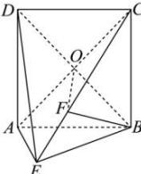

> [!faq]- 全练一本通解析
> **【答案】** （1） $\frac{\sqrt{6}}{3}$ ；（2） $\frac{2}{3}\sqrt{3}$
>
> **【解析】**
> （1）连接 $BD\cap AC = O$ ，连接OF，如图，
> 
> 由四边形 ABCD 是边长为 2 的正方形, 得 $BD \perp AC$ , 且 O 为 AC 的中点, $BO = \sqrt{2}$ ,
> 由 $BF \perp$ 平面 $ACE, AC \subset$ 平面 $ACE$ , 得 $BF \perp AC$ , 而
> $BD \cap BF = B, BD, BF \subset$ 平面 BOF
> 则 $AC \perp$ 平面 $BOF$ , 又 $OF \subset$ 平面 $BOF$ , 于是 $OF \perp AC$ , 因此 $\angle BOF$ 是二面角 $B - AC - E$ 的平面角,
> 由二面角 $D - AB - E$ 为直二面角, 得平面 $ABCD \perp$ 平面 $ABE$ , 而平面 $ABCD \cap$ 平面 $ABE = AB$ ,
> 又 $CB \perp AB$ ， $CB \subset$ 平面ABCD，则有 $CB \perp$ 平面ABE， $AE, BE \subset$ 平面ABE，
> 则 $CB \perp AE$ ，由 $BF \perp$ 平面 $ACE$ ， $AE \subset$ 平面 $ACE$ ，得
> $BF \perp AE$ , $BC \cap BF = B, BC, BF \subset$ 平面 BCE,
> 于是 $AE \perp$ 平面 $BCE$ ，而 $BE \subset$ 平面 $BCE$ ，则 $AE \perp BE$ ，又 $AE = EB$ ，因此 $EB = \sqrt{2}$ ，
> 显然 $CB \perp BE$ ，从而 $CE = \sqrt{BC^2 + BE^2} = \sqrt{6}$ ，由 $BF \perp$ 平面
> ACE, CE, OF ⊂ 平面 ACE, 得 $BF \perp CE, BF \perp OF$
> 于是 $BF = \frac{BC\cdot BE}{CE} = \frac{2\sqrt{2}}{\sqrt{6}} = \frac{2\sqrt{3}}{3}$ ，则 $\sin \angle BOF = \frac{BF}{BO} = \frac{\sqrt{6}}{3}$
> 所以二面角 $B - AC - E$ 的正弦值为 $\frac{\sqrt{6}}{3}$
> （2）由（1）知， $BF=\frac{2\sqrt{3}}{3}$ ，O为线段BD的中点，即平面ACE经过线段BD的中点，
> 因此点 D 到平面 ACE 的距离等于点 B 到平面 ACE 的距离, 而 $BF \perp$ 平面 ACE, 即点 B 到平面 ACE 的距离为线段 BF 长 $\frac{2\sqrt{3}}{3}$ ,
> 所以点 D 到平面 ACE 的距离为 $\frac{2\sqrt{3}}{3}$ .
