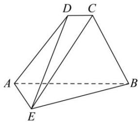

<!-- question-source:start -->
【25】已知四棱锥 E-ABCD 中，AE=2，CD//AB， $AB=4CD=4,\ AD=2\sqrt{2},\angle DAB=45^{\circ}$ ，面
ABCD⊥面 ABE, CE= $\sqrt{17}$ , 求证: $AE \perp CB$ .

<!-- question-source:end -->

![[Q00006091A1]]
