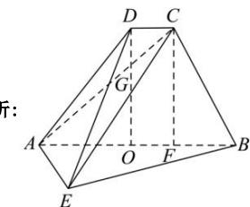

> [!faq]- 全练一本通解析
> **【答案】** 详见解析
>
> **【解析】**
> 见解析
> 
> 由题知， $AB = 4CD = 4$ ，AE = 2， $CD // AB$ ， $AD = 2\sqrt{2}$ ， $\angle DAB = 45^{\circ}$ ，面 ABCD ⊥ 面 ABE， $CE = \sqrt{17}$ .
> 过 D 作 DO ⊥ AB，过 C 作 CF ⊥ AB，即 DO // CF，
> 连接 AC 交 DO 于 G，
> 因为 CD // AB，
> 所以四边形 OFCD 为平行四边形，
> 所以 OF = CD, OD = FC，
> 因为在 $\triangle ADO$ 中， $AD = 2\sqrt{2}$ , $\angle DAO = 45^{\circ}$ , $DO \perp AO$ 所以 DO = AO = 2，
> 所以 CF = 2，
> 因为 AB = 4CD = 4，CD // AB，OF = CD，
> 所以 OF = CD = 1
> 所以 AF = 3，
> 因为 CF ⊥ AB，
> 所以 $AC = \sqrt{AF^{2} + CF^{2}} = \sqrt{9 + 4} = \sqrt{13}$ 因为 $CE = \sqrt{17}$ ，AE = 2，
> 所以在 $\triangle ACE$ 中， $CE^{2} = AE^{2} + AC^{2}$ ，即 $AE \perp AC$ 又因为 DO ⊥ AB，平面 ABCD ⊥ 平面 ABE 且交于 AB，
> 所以 DO ⊥ 面 ABE，
> 因为 AE ⊂ 面 ABE，
> 所以 DO ⊥ AE，
> 因为 DO ∩ AC = G, DO, AC ⊂ 平面 ABCD，
> 所以 AE ⊥ 平面 ABCD，
> 因为 CB ⊂ 平面 ABCD，
> 所以 AE ⊥ CB.
