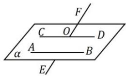

## 1. 异面直线所成角

<table><tr><td>定义</td><td>范围</td><td>图示</td><td>表示</td></tr><tr><td>空间中的两条异面直线,通过平移转化为求相交直线所成的锐角或直角</td><td> $(0°,90°]$ </td><td></td><td> $\because AB//CD,\therefore\angle FOD$ (或其补角)为异面直线AB与EF所成的角(或夹角).</td></tr></table>
