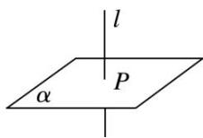

## 3. 直线和平面垂直的定义

如果直线 l 和平面 $\alpha$ 内的任意一条直线都垂直, 我们就说直线 l 与平面 $\alpha$

互相垂直, 记作 $l \perp \alpha$ . 直线 $l$ 叫平面 $\alpha$ 的垂线; 平面 $\alpha$ 叫直线 $l$ 的垂面;

垂线和平面的交点叫垂足.

注意: 直线与平面垂直的定义具有两重性, 既是判定又是性质. 是判定, 指它是判定直线与平面垂直的方法; 是性质, 指如果一条直线垂直于一个平面, 那么这条直线就垂直于这个平面内的任何一条直线.
