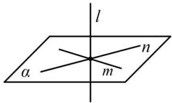
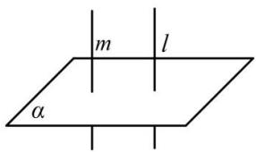

## 4. 直线和平面垂直的判定定理与性质定理

<table><tr><td rowspan="2">判定定理</td><td>自然语言</td><td>图形语言</td><td>符号语言</td></tr><tr><td>一条直线与一个平面内的两条相交直线都垂直,则该直线与此平面垂直.</td><td></td><td> $\left.\begin{matrix}m\subset\alpha,n\subset\alpha \\m\cap n\neq\emptyset \\l\perp m,l\perp n\end{matrix}\right\}\Rightarrow l\perp\alpha$ </td></tr><tr><td>性质定理</td><td>垂直于同一个平面的两条直线平行.</td><td></td><td> $\left.\begin{matrix}l\perp\alpha \\m\perp\alpha\end{matrix}\right\}\Rightarrow l//m$ </td></tr></table>

## 其他性质：

（1）如果一条直线垂直于一个平面，那么该直线垂直于平面内的所有直线.

(2) 过一点有且只有一条直线与已知平面垂直.

（3）过一点有且只有一个平面与已知直线垂直.

（4）如果两条平行直线中的一条直线垂直于一个平面,那么另一条也垂直于这个平面

（5）如果一条直线垂直于两个平行平面中的一个，那么它必垂直于另一个平面.
