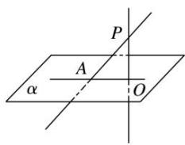

## 5. 直线和平面所成角

<table><tr><td colspan="2">有关概念</td><td>对应图形</td></tr><tr><td>斜线</td><td>一条直线与平面α相交,但不与这个平面垂直,这条直线叫做这个平面的斜线,如图中直线PA</td><td rowspan="3"></td></tr><tr><td>斜足</td><td>斜线和平面的交点,图中点A</td></tr><tr><td>射影</td><td>过斜线上斜足以外的一点向平面引垂线,过垂足和斜足的直线叫做斜线在这个平面上的射影,图中斜线PA在平面α上的射影为直线AO</td></tr><tr><td>直线与平面所成的角</td><td colspan="2">定义:平面的一条斜线和它在平面上的射影所成的角,图中∠PAO规定:一条直线垂直于平面,它们所成的角是90°;一条直线和平面平行,或在平面内,它们所成的角是0°</td></tr><tr><td>取值范围</td><td colspan="2">设直线与平面所成的角为θ,0°≤θ≤90°</td></tr></table>
