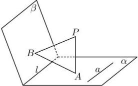

<!-- question-source:start -->
【21】(2023·上海高二专题练习)如图,平面 $\alpha\cap$ 平面 $\beta=l,PA\perp\alpha,PB\perp\beta$ ,垂足分别为 $A,B$ ,直线 $a\subset$ 平面 $\alpha,a\perp AB$ .求证: $a\parallel l$ .

<!-- question-source:end -->

![[Q00008916A1]]
