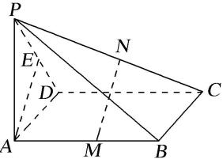

<!-- question-source:start -->
【23】(2024·全国高一专题练习)如图,在四棱锥 $P-ABCD$ 中,底面 $ABCD$ 是矩形, $AB\perp$ 平面 $PAD,AD=AP,E$ 是 $PD$ 的中点, $M,N$ 分别在 $AB,PC$ 上,且 $MN\perp AB,MN\perp PC$ .证明: $AE//MN$ .

<!-- question-source:end -->

![[Q00008918A1]]
