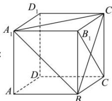

> [!faq]- 全练一本通解析
> **【答案】** B
>
> **【解析】**
> 解析：
> 
> 如图, 正方体 $ABCD - A_{1}B_{1}C_{1}D_{1}$ 中.
> $B_{1}C \perp BC_{1}$ ， $BC_{1} \subset$ 平面 $A_{1}BC_{1}$ ，显然 $B_{1}C$ 与平面 $A_{1}BC_{1}$ 不垂直，故“ $l \perp m$ ”不是“ $l \perp \alpha$ ”的充分条件；
> 若 $l\perp\alpha$ ，根据线面垂直的性质定理, 可知 $l\perp m$ 成立, 所以“ $l\perp m$ ”是“ $l\perp\alpha$ ”的必要条件. 所以, “ $l\perp m$ ”是“ $l\perp\alpha$ ”的必要不充分条件.
>
> 故选 **B**.
