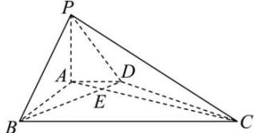

<!-- question-source:start -->
【8】如图, 在四棱锥 P-ABCD 中, 已知 $AD \parallel BC$ , $\angle ABC = 90^{\circ}$ , AC 与 BD 相交于点 E, 且 $PA \perp BD$ , $AD = 1$ , $AB = \sqrt{3}$ , BC = 3, 求证: $BD \perp$ 平面 PAC.

<!-- question-source:end -->

![[Q00005971A1]]
