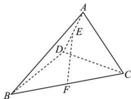

<!-- question-source:start -->
【13】（2022·全国高一课时练习）如图，在四面体 $A - BCD$ 中， $\angle BDC = 90^{\circ}$ ， $AC = BD = 2$ ， $E$ ， $F$ 分别为 $AD$ ， $BC$ 的中点，且 $EF = \sqrt{2}$ .求证： $BD\bot$ 平面 $ACD$ ：

<!-- question-source:end -->

![[Q00005976A1]]
