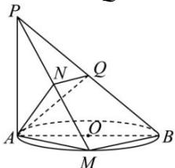

<!-- question-source:start -->
【14】如图, AB 为 $\odot O$ 的直径, PA 垂直于 $\odot O$ 所在的平面, M 为圆周上任意一点, $AN \perp PM$ , N 为垂足.
（1）求证： $AN \perp$ 平面 PBM;
（2）若 $AQ \perp PB$ ，垂足为 Q，求证： $PB \perp$ 平面 ANQ.

<!-- question-source:end -->

![[Q00005977A1]]
