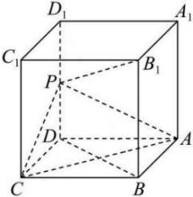

<!-- question-source:start -->
【15】（2023·湖北黄石高二上期末）如图，长方体 $ABCD-A_{1}B_{1}C_{1}D_{1}$ 中，AB=AD=2, $AA_{1}=4$ ，点P为 $DD_{1}$ 的中点，求证：直线 $PB_{1}\perp$ 平面PAC.

<!-- question-source:end -->

![[Q00005978A1]]
