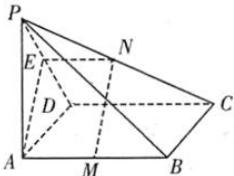

> [!faq]- 全练一本通解析
> **【答案】** 证明见解析.
>
> **【解析】**
> 证明:取 PD 的中点 E, 连接 AE, NE, 如图:
> 
> ∵ M, N 分别是 AB, PC 的中点,
> ∴ $EN=\frac{1}{2}CD=\frac{1}{2}AB=AM$ ，且 $EN//CD//AB$ 。
> ∴四边形 AMNE 是平行四边形.
> $$
> \therefore M N \parallel A E
> $$
> ∵在等腰三角形 PAD 中, AE 是中线, ∴ $AE \perp PD$ .
> $$
> C D \perp A D, C D \perp P A, \therefore C D \perp
> $$
> $$
> \therefore C D \perp A E. \text {又} C D \cap P D = D
> $$
> $$
> \therefore A E \perp
> $$
> $$
> P A D
> $$
> $$
> P C D
> $$
> $$
> P C D
> $$
