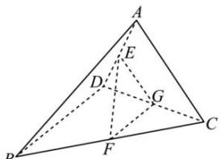

> [!faq]- 全练一本通解析
> **【答案】** 见详解
>
> **【解析】**
> 取 CD 的中点为 G, 连接 EG, FG.
> ∵ F, G 分别为 BC, CD 的中点,
> ∴ FG // BD, 又 E 为 AD 的中点,
> AC = BD = 2, ∴ EG = FG = 1.
> ∵ EF = $\sqrt{2}$ , ∴ $EF^{2} = EG^{2} + FG^{2}$ ,
> ∴ EG ⊥ FG, ∴ BD ⊥ EG.
> ∵ $\angle BDC=90^{\circ}$ , ∴ BD ⊥ CD.
> 又 EG ∩ CD = G, EG, CD ⊂ 平面 ACD
> ∴ BD ⊥ 平面 ACD.
> 
