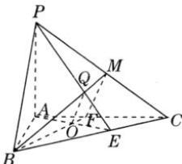

> [!faq]- 全练一本通解析
> **【答案】** 证明见解析
>
> **【解析】**
> 证明:如图,连接 AO 并延长交 BC 于点 E,连接 PE.
> 
> ∵ PA⊥平面ABC, BC⊂平面ABC, ∴ PA⊥BC,
> ∵ AE⊥BC（由于O是△ABC的垂心），PA∩AE=A，∴ BC⊥平面PAE
> ∵ PE⊂平面PAE, ∴ PE⊥BC
> 因为Q为△PBC的垂心，∴点Q在PE上.
> ∵ BC⊥平面PAE, $OQ\subset$ 平面PAE, ∴ BC⊥OQ①
> 连接BO并延长交AC于点F，则BF⊥AC.
> 连接BQ并延长交PC于点M，则BM⊥PC.连接MF.
> ∵ PA⊥平面ABC, BF⊂平面ABC, ∴ PA⊥BF
> ∵ BF⊥AC, PA∩AC=A, ∴ BF⊥平面PAC
> ∵ PC⊂平面PAC, ∴ BF⊥PC.
> ∴而BM∩BF=B, ∴ PC⊥平面BMF, 而OQ⊂平面BMF, ∴ PC⊥OQ②
> ∵ BC∩PC=C, 由①②知: OQ⊥平面PBC.
