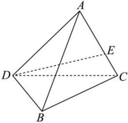
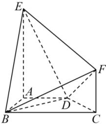

<!-- question-source:start -->
【22】如图,已知在多面体 $ABCDEF$ 中, $AD//BC,AB\perp BC,AE\perp$ 平面 $ABCD,CF\perp$ 平面 $ABCD$ ,求证:平面 $BCF//$ 平面 $ADE$ .</td></tr><tr><td></td><td></td></tr><tr><td></td><td>
<!-- question-source:end -->

![[Q00005985A1]]
